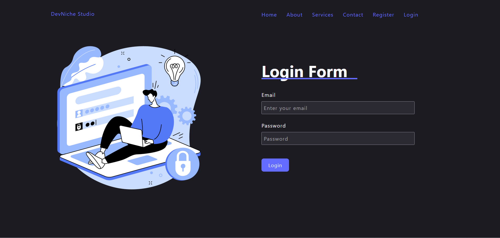

# DevNiche Studio

Welcome to **DevNiche Studio** – a cutting-edge MERN stack web application designed for seamless user management and authentication. This repository contains the frontend code for the project.



## 🛠 Features

- **User Authentication**: Secure login and registration with JWT and bcryptjs.
- **Responsive Design**: Modern and intuitive UI with React.js.
- **Enhanced UX**:
  - **react-modal** for user-friendly modals.
  - **react-toastify** for engaging toast notifications.
  - **react-icons** for a stylish icon set.
  - **react-loader-spinner** for smooth loading experiences.

## 📦 Technologies Used

### Frontend

- **React.js**: For building the user interface.
- **react-modal**: For creating modals.
- **react-toastify**: For displaying notifications.
- **react-icons**: For incorporating icons.
- **react-loader-spinner**: For showing loading indicators.

### Backend

- **Express.js**: Web framework for Node.js.
- **MongoDB & Mongoose**: For database management and object modeling.
- **JWT & bcryptjs**: For authentication and password hashing.
- **dotenv**: For environment variable management.
- **CORS**: For handling cross-origin requests.

## 🔗 Getting Started

### Prerequisites

Ensure you have the following installed:

- [Node.js](https://nodejs.org/) (v14 or later)
- [npm](https://www.npmjs.com/) (v6 or later)

### Installation

1. **Clone the repository:**

    ```bash
    git clone https://github.com/iMamoonAkhter/DevNicheStudio_Frontend.git
    ```

2. **Navigate to the project directory:**

    ```bash
    cd DevNicheStudio_Frontend
    ```

3. **Install dependencies:**

    ```bash
    npm install
    ```

4. **Run the application:**

    ```bash
    npm run dev
    ```

   The app will be available at `http://localhost:3000`.

## 📸 Screenshot

Here's a glimpse of what DevNiche Studio looks like:


## 📝 Contributing

Contributions are welcome! If you have suggestions or improvements, please feel free to open an issue or submit a pull request.

## 📧 Contact

For any inquiries or further information, you can reach out to me via [LinkedIn](https://www.linkedin.com/in/iMamoonAkhter).

---

Thank you for checking out DevNiche Studio! 🎉

#DevNicheStudio #MERNStack #React #WebDevelopment #OpenSource
